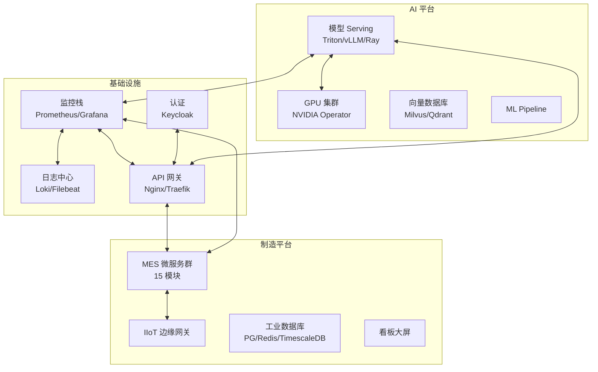

# AI-WAREHOUSE 🏭🤖

> **复合AI平台 · 运维实施仓库**
>
> 面向 AI + 智能制造融合平台的**基础设施即代码（IaC）**与**运维实施中心**。
> 覆盖从 GPU 集群管理、模型 Serving 部署到制造执行系统（MES）全链路的
> 部署、监控、灾备与日常运维。

[]()

---

## 📌 仓库定位

本仓库**不是**软件开发仓库，而是**运维实施**的单一可信源（Single Source of Truth）：

| 包含 ✅ | 不包含 ❌ |
|---------|----------|
| Docker Compose / K8s 编排文件 | 微服务业务源码 |
| Prometheus / Grafana 监控配置 | 前端 / 移动端代码 |
| 部署 & 回滚脚本 | 开发环境构建工具链 |
| Ansible / Terraform 自动化 | 单元测试 / 集成测试 |
| 数据库迁移与备份策略 | 业务逻辑代码 |
| AI 模型 Serving 与 GPU 运维 | 模型训练代码 |
| 应急预案 / SOP / Runbooks | 产品需求文档 |
| SSL 证书 / 网络 / 安全基线 | UI/UX 设计稿 |

---

## 🏗️ 目录概览

```
AI-WAREHOUSE/
├── environments/          # 🌍 环境定义（dev/staging/prod）
├── orchestration/         # 🐳 容器编排（Docker + K8s）
├── ai-ops/               # 🤖 AI 平台运维（GPU/模型/向量库）
├── cicd/                 # 🔄 CI/CD 流水线
├── monitoring/           # 📊 监控与可观测性
├── database/             # 🗄️ 数据库运维
├── disaster-recovery/    # 🛡️ 灾备与恢复
├── security/             # 🔒 安全运维
├── network/              # 🌐 网络管理
├── asset-management/     # 📋 资产清单
├── runbooks/             # 📖 运维手册（SOP）
├── automation/           # ⚙️ 自动化（Ansible/Terraform）
├── scripts/              # 🔧 工具脚本
└── docs/                 # 📝 文档
```

---

## 🚀 快速导航

| 我想做什么 | 去看这里 |
|-----------|---------|
| 查看环境配置 | [`environments/`](environments/) |
| 部署整个平台 | [`orchestration/docker/docker-compose.yml`](orchestration/docker/docker-compose.yml) |
| 部署 AI 模型 | [`ai-ops/model-serving/`](ai-ops/model-serving/) |
| 查看 GPU 状态 | [`ai-ops/gpu/monitoring/`](ai-ops/gpu/monitoring/) |
| 部署到 K8s | [`orchestration/kubernetes/`](orchestration/kubernetes/) |
| 配置告警规则 | [`monitoring/prometheus/rules/`](monitoring/prometheus/rules/) |
| 查看部署手册 | [`runbooks/deployment/`](runbooks/deployment/) |
| 故障排查 | [`runbooks/troubleshooting/`](runbooks/troubleshooting/) |
| 数据库备份 | [`database/postgresql/backup/`](database/postgresql/backup/) |
| 灾备恢复 | [`disaster-recovery/restore/runbooks/`](disaster-recovery/restore/runbooks/) |

---

## 📋 管理范围

### 系统组件



---

## 🔧 快速使用

```bash
# ── 本地全栈部署 ──
docker compose -f orchestration/docker/docker-compose.yml up -d

# ── 仅 AI 服务 ──
docker compose -f orchestration/docker/docker-compose.ai.yml up -d

# ── 仅监控栈 ──
docker compose -f orchestration/docker/docker-compose.monitor.yml up -d

# ── K8s 部署 ──
kubectl apply -k orchestration/kubernetes/base/
```

---

## 🧭 运维原则

1. **IaC 优先** — 所有环境配置以代码形式管理，可追溯、可复现
2. **不可变基础设施** — 不手工登录修改服务器，变更走 CI/CD 或 IaC
3. **可观测性** — 无监控不发布，所有服务必须挂载到监控体系
4. **文档即运维** — SOP/Runbook 与配置同步更新
5. **最小权限** — 密钥使用临时凭证 + 自动轮转

---

## 🤝 贡献

提交 Issue 或 PR 时请参考 [Issue 模板](.github/ISSUE_TEMPLATE/)。
所有变更需更新对应 runbook 和监控面板。

---

## 📄 许可

MIT License — 详见 [LICENSE](LICENSE)
