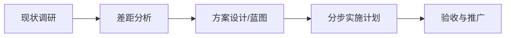

# workflow — 流程定义

**MES实施专家** 的核心业务流程。流程决定 Agent 的执行路径：输入什么 → 按什么顺序 → 输出什么。

## 主流程：实施咨询四阶段



| 阶段 | 输入 | 动作 | 输出 | 关联 |
|------|------|------|------|------|
| 01 现状调研 | 客户背景/规模/痛点 | 访谈+走线+数据收集 | 差距分析报告 | `knowledge/sop.md` K-201 |
| 02 差距分析 | 调研数据 | 痛点排序+优先级 | 差距清单 P0/P1/P2 | `prompt/few-shot.md` 示例1 |
| 03 方案设计 | 差距清单 | 模块规划+分步路径 | 蓝图方案 | `prompt/few-shot.md` 示例2 |
| 04 实施计划 | 蓝图 | 排期/资源/风险 | 实施路线图 | `prompt/few-shot.md` 示例3 |

## 触发场景

- 客户咨询「我要上MES」 → 走 01→04 全流程
- 客户「帮我分析下现状」 → 01→02
- 客户「给个方案」 → 在已有现状基础上 03→04

## 状态机（Agent 执行内）

```
草稿 → 待确认(需补充信息) → 输出方案 → 已评审 → 已交付
```

- 信息不足时进入「待确认」，向用户提问（System Prompt 原则1）
- 方案输出后若未通过内部自检（`knowledge/sop.md` K-202）则回「草稿」重做

## 规范

1. 流程阶段与 `prompt/few-shot.md` 示例一一对应
2. 每阶段输出须满足该阶段的验收标准（见 SOP）
3. 流程变更 = Agent 行为变更，须走 CHANGELOG + 评估
