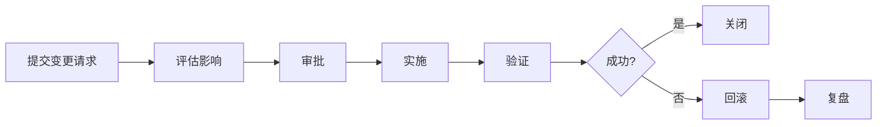

# 变更管理流程

> **目的**: 确保所有运维变更可追溯、可回滚、最小化影响

---

## 变更级别

| 级别 | 定义 | 审批 | 变更窗口 | 回滚要求 |
|------|------|------|---------|---------|
| **L1 - 标准** | 常规发布、配置更新 | 技术 Leader | 任意工作日 | 自动回滚脚本 |
| **L2 - 重大** | 架构变更、数据库迁移 | Ops Manager | 维护窗口 | 演练过回滚方案 |
| **L3 - 紧急** | 安全修复、故障恢复 | On-Call 审批 | 立即 | 必须 |

---

## 变更流程



## 变更模板

```
## 变更标题

### 基本信息
- 变更编号: CHG-{{date}}-{{num}}
- 申请人: @name
- 级别: L1 / L2 / L3
- 时间窗口: YYYY-MM-DD HH:mm ~ HH:mm

### 变更内容
描述变更的详细操作。

### 影响范围
列出受影响的服务、用户。

### 回滚方案
```bash
# 回滚命令
```

### 验证步骤
1. 步骤1
2. 步骤2

### 审批人
- [ ] 技术审批: @name
- [ ] 安全审批: @name (如适用)
